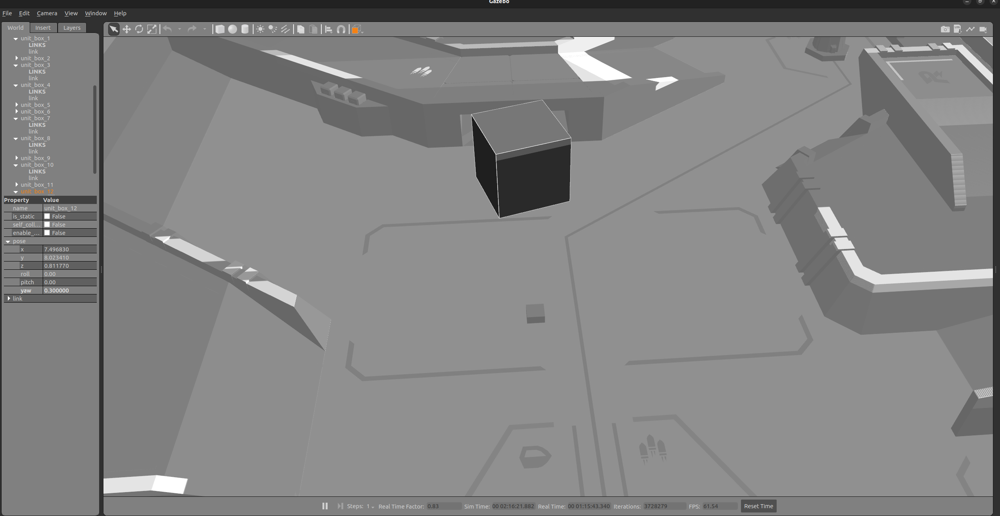
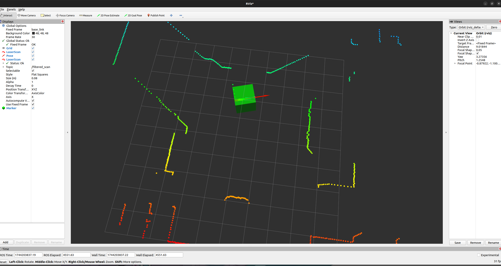

# robomaster_ore_detector
## 编译
````bash
colcon build --symlink-install --cmake-args -DCMAKE_BUILD_TYPE=Release -DCMAKE_EXPORT_COMPILE_COMMANDS=1
````
## 运行
````bash
ros2 launch wuthering_waves bring_up.launch.py #仿真
ros2 run ore_detector ore_detector_node #识别节点
ros2 run rviz2 rviz2 -d /home/usrname/robomaster_ore_detector/src/ore_detector/config/rviz.rviz 
````

## 仿真效果


## rviz2可视化
